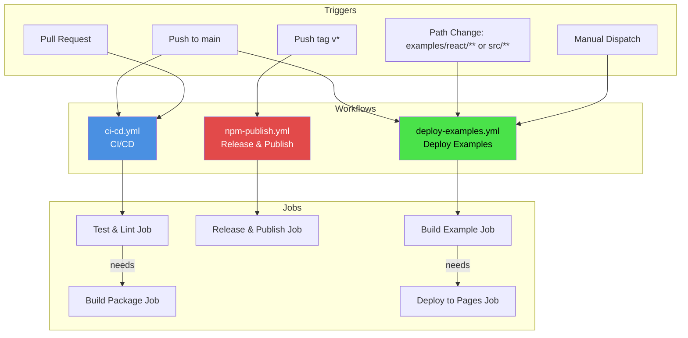
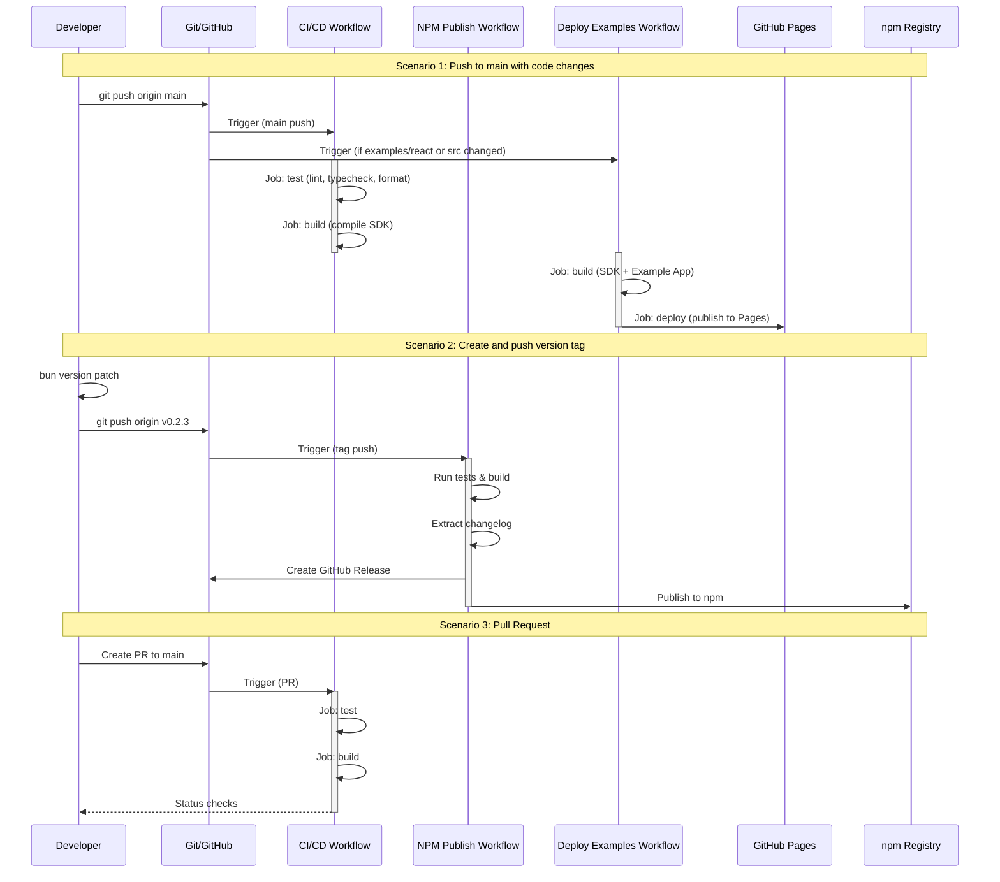

# GitHub Actions Workflows Analysis

## Workflow Overview

This repository has 3 GitHub Actions workflows with different triggers and purposes:



---

## 1. ci-cd.yml - Continuous Integration

### Triggers

- **Push to `main` branch**
- **Pull requests targeting `main`**
- **Release creation events**

### Jobs

#### Job 1: `test` (Test & Lint)

**Runs on:** `ubuntu-latest`
**No dependencies**

**Steps:**

1. Checkout code
2. Setup Bun (latest)
3. Install dependencies (`bun install --frozen-lockfile`)
4. Run linter (`bun run lint`)
5. Run type check (`bun run typecheck`)
6. Run formatter check (`bun run format:check`)

**Purpose:** Validate code quality, types, and formatting

---

#### Job 2: `build` (Build Package)

**Runs on:** `ubuntu-latest`
**Depends on:** `test` job (via `needs: test`)

**Steps:**

1. Checkout code
2. Setup Bun (latest)
3. Install dependencies (`bun install --frozen-lockfile`)
4. Build package (`bun run build`)
5. Upload build artifacts to GitHub (7-day retention)

**Purpose:** Build the SDK package and verify it compiles successfully

---

## 2. npm-publish.yml - Release & Publish to npm

### Triggers

- **Push tags matching pattern `v*`** (e.g., `v0.2.3`, `v1.0.0`)

### Permissions

- `contents: write` - Create GitHub releases
- `id-token: write` - Publish with provenance

### Jobs

#### Job: `release` (Create Release & Publish)

**Runs on:** `ubuntu-latest`
**No dependencies**

**Steps:**

1. Checkout code
2. Setup Bun (latest)
3. Install dependencies (`bun install`)
4. Run tests (`bun run typecheck && bun run lint`)
5. Build package and verify types (`bun run build:check`)
6. Extract version from git tag
7. Extract changelog section for this version from CHANGELOG.md
8. Create GitHub Release with:
   - Name: `v{VERSION}`
   - Body: Extracted changelog
   - Not a draft
   - Not a prerelease
9. Setup npm authentication
10. Publish to npm with:
    - Provenance enabled
    - Public access

**Purpose:** Automate the release process when a version tag is pushed

**Requires:**

- `NPM_TOKEN` secret configured in repository

---

## 3. deploy-examples.yml - Deploy Examples to GitHub Pages

### Triggers

- **Push to `main` branch** with changes in:
  - `examples/react/**`
  - `src/**`
  - `.github/workflows/deploy-examples.yml`
- **Manual dispatch** (workflow_dispatch)

### Permissions

- `contents: read`
- `pages: write` - Deploy to GitHub Pages
- `id-token: write` - Required for Pages deployment

### Concurrency

- Group: `pages`
- Cancel in progress: `false` (only one deployment at a time)

### Jobs

#### Job 1: `build` (Build Example App)

**Runs on:** `ubuntu-latest`
**No dependencies**

**Steps:**

1. Checkout code
2. Setup Bun (latest)
3. Install SDK dependencies (`bun install --frozen-lockfile`)
4. Build SDK (`bun run build`)
5. Generate API docs JSON (`bun run docs:json`)
6. Install example dependencies (`bun install` in `examples/react`)
7. Build example app (`bun run build` in `examples/react`)
   - Environment: `production`
   - PostHog analytics keys from secrets
8. Prepare deployment directory (copy build to `_site/`)
9. Upload Pages artifact

**Purpose:** Build the React example application with the latest SDK

**Requires:**

- `VITE_PUBLIC_POSTHOG_KEY` secret (optional)
- `VITE_PUBLIC_POSTHOG_HOST` secret (optional)

---

#### Job 2: `deploy` (Deploy to GitHub Pages)

**Runs on:** `ubuntu-latest`
**Depends on:** `build` job (via `needs: build`)

**Environment:**

- Name: `github-pages`
- URL: Deployment output URL

**Steps:**

1. Deploy to GitHub Pages

**Purpose:** Deploy the built example app to GitHub Pages

---

## Workflow Dependencies Graph



---

## Summary

### Workflow Triggers Matrix

| Workflow                | Push main | PR to main | Push tag `v*` | Path change              | Manual |
| ----------------------- | --------- | ---------- | ------------- | ------------------------ | ------ |
| **ci-cd.yml**           | ✅        | ✅         | ❌            | ❌                       | ❌     |
| **npm-publish.yml**     | ❌        | ❌         | ✅            | ❌                       | ❌     |
| **deploy-examples.yml** | ✅        | ❌         | ❌            | ✅ (examples/react, src) | ✅     |

### Job Dependencies

#### ci-cd.yml

```
test → build
```

#### npm-publish.yml

```
release (standalone)
```

#### deploy-examples.yml

```
build → deploy
```

### Required Secrets

| Secret                     | Used In             | Purpose                      |
| -------------------------- | ------------------- | ---------------------------- |
| `NPM_TOKEN`                | npm-publish.yml     | Publish to npm registry      |
| `VITE_PUBLIC_POSTHOG_KEY`  | deploy-examples.yml | PostHog analytics (optional) |
| `VITE_PUBLIC_POSTHOG_HOST` | deploy-examples.yml | PostHog analytics (optional) |

---

## Best Practices Observed

✅ **Frozen lockfiles** - All workflows use `--frozen-lockfile` for reproducible builds
✅ **Job dependencies** - Build jobs depend on test/lint passing
✅ **Artifact retention** - Build artifacts kept for 7 days
✅ **Provenance** - npm publishing includes provenance for supply chain security
✅ **Changelog automation** - Extracts version-specific changelog for releases
✅ **Path-based triggers** - Examples only deploy when relevant files change
✅ **Concurrency control** - Pages deployment prevents race conditions
✅ **Environment separation** - Production builds use proper environment variables

---

## Improvement Suggestions

1. **Add caching** - Cache Bun dependencies to speed up workflows:

   ```yaml
   - name: Cache dependencies
     uses: actions/cache@v4
     with:
       path: ~/.bun/install/cache
       key: ${{ runner.os }}-bun-${{ hashFiles('**/bun.lockb') }}
   ```

2. **Add test job to npm-publish.yml** - Currently only runs typecheck & lint
   - Consider adding unit tests if available

3. **Add build status badge** - Show CI/CD status in README

4. **Consider semantic-release** - Automate version bumping and changelog generation

5. **Add deployment preview** - Deploy PR previews to GitHub Pages for review
