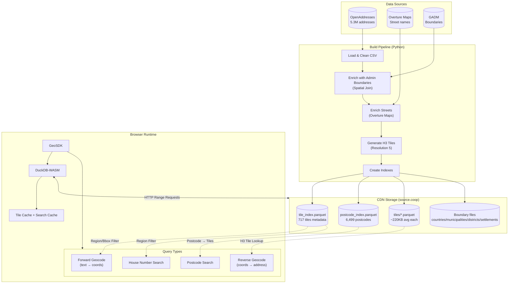

# Saudi Arabia Geocoding SDK

[](https://www.npmjs.com/package/@tabaqat/geocoding-sdk)
[](https://github.com/tabaqatdev/geocoding-wasm/actions/workflows/ci-cd.yml)
[](https://github.com/tabaqatdev/geocoding-wasm/actions/workflows/deploy-examples.yml)
[](https://opensource.org/licenses/MIT)
[](https://bundlephobia.com/package/@tabaqat/geocoding-sdk)

**v0.4.1** - A browser-based geocoding SDK for Saudi Arabia using DuckDB-WASM. Zero backend dependencies - runs entirely in the browser with automatic fallback to default data source.

## Live Examples

Check out the interactive documentation and demos:

- Try the [interactive playground](https://tabaqatdev.github.io/geocoding-sdk/) to see the SDK in action.
- **[React Example App](https://tabaqatdev.github.io/geocoding-sdk/examples/react/)** - Comprehensive demo with all SDK features
  - Playground with forward/reverse geocoding, postcode search
  - Full API documentation with interactive examples
  - MapLibre GL integration example
  - Arabic/English RTL/LTR support

## Architecture


```mermaid
flowchart TB
    subgraph DataSources["Data Sources"]
        OA[("OpenAddresses<br/>5.3M addresses")]
        OM[("Overture Maps<br/>Street names")]
        GADM[("GADM<br/>Boundaries")]
    end

    subgraph BuildPipeline["Build Pipeline (Python)"]
        direction TB
        B1["Load & Clean CSV"]
        B2["Enrich with Admin Boundaries<br/>(Spatial Join)"]
        B3["Enrich Streets<br/>(Overture Maps)"]
        B4["Generate H3 Tiles<br/>(Resolution 5)"]
        B5["Create Indexes"]
    end

    subgraph CDN["CDN Storage (source.coop)"]
        TI[("tile_index.parquet<br/>717 tiles metadata")]
        PI[("postcode_index.parquet<br/>6,499 postcodes")]
        TILES[("tiles/*.parquet<br/>~220KB avg each")]
        BOUNDS[("Boundary files<br/>countries/municipalities/districts/settlements")]
    end

    subgraph Browser["Browser Runtime"]
        SDK["GeoSDK"]
        DUCKDB["DuckDB-WASM"]
        CACHE["Tile Cache + Search Cache"]

        subgraph Queries["Query Types"]
            FWD["Forward Geocode<br/>(text → coords)"]
            REV["Reverse Geocode<br/>(coords → address)"]
            POST["Postcode Search"]
            NUM["House Number Search"]
        end
    end

    OA --> B1
    OM --> B3
    GADM --> B2
    B1 --> B2 --> B3 --> B4 --> B5
    B5 --> TI & PI & TILES & BOUNDS

    SDK --> DUCKDB
    DUCKDB <-->|"HTTP Range Requests"| CDN
    DUCKDB --> CACHE
    SDK --> Queries

    TI -.->|"Region/Bbox Filter"| FWD
    PI -.->|"Postcode → Tiles"| POST
    TILES -.->|"H3 Tile Lookup"| REV
    TI -.->|"Region Filter"| NUM
```

### How It Works

1. **Initialization** (~140KB): Loads tile index, postcode index, and boundary files
2. **Reverse Geocoding**: Computes H3 cell from coordinates → loads only that tile (~220KB)
3. **Forward Geocoding**: Uses region/bbox filters → queries only relevant tiles
4. **Postcode Search**: Looks up postcode in index → loads mapped tiles (avg 1.3 tiles)
5. **All queries**: DuckDB-WASM executes SQL on Parquet via HTTP range requests

## Features

- **Forward Geocoding**: Convert addresses to coordinates with FTS/BM25 or Jaccard similarity matching
- **Smart Geocoding**: Auto-detects postcodes and regions in query for optimized routing
- **Cached Geocoding**: LRU cache (100 entries, 5min TTL) for faster repeated searches
- **Reverse Geocoding**: Find nearest addresses from coordinates with H3 tile-based spatial indexing
- **Postcode Search**: Ultra-fast postcode lookups using indexed tile mapping (~1.3 tiles per postcode)
- **House Number Search**: Search by building number with region/bbox filtering
- **Country Detection**: Identify country from coordinates using spatial containment
- **Admin Hierarchy**: Get 6-level admin info (region, governorate, municipality, district, settlement, major city) with distance for Saudi Arabia coordinates
- **Autocomplete Suggestions**: Get district, postcode, and region suggestions for typeahead
- **H3 Tile Loading**: Ultra-fast on-demand loading (~220KB average per tile)
- **Region Filtering**: Filter searches by single or multiple region names
- **Bbox Filtering**: Optimize forward geocoding by limiting search to visible map area
- **Debug Logging**: Native `console.*` logging gated by `debug` flag — filter in browser DevTools
- **Bilingual**: Full support for Arabic and English

## Performance

| Metric                   | Value                       |
| ------------------------ | --------------------------- |
| Reverse geocode (cold)   | **< 4 seconds**             |
| Reverse geocode (cached) | **< 100ms**                 |
| Forward geocode (bbox)   | **2-5 seconds**             |
| Forward geocode (cached) | **< 500ms**                 |
| Postcode search          | **< 500ms** (avg 1.3 tiles) |
| Average tile size        | **220 KB**                  |
| Largest tile             | **6 MB**                    |
| Total tiles              | **717**                     |
| Total postcodes          | **6,499**                   |
| Initial load             | **~140 KB**                 |

## Installation

```bash
# npm
npm install @tabaqat/geocoding-sdk

# bun
bun add @tabaqat/geocoding-sdk

# pnpm
pnpm add @tabaqat/geocoding-sdk

# yarn
yarn add @tabaqat/geocoding-sdk
```

## Quick Start

### Basic Usage

```typescript
import { GeoSDK } from '@tabaqat/geocoding-sdk';

// Initialize SDK with options
const sdk = new GeoSDK({
  debug: true, // Enable debug logging (uses native console.*)
});
await sdk.initialize();

// Forward geocoding (address → coordinates)
const results = await sdk.geocode('حي الروضة الرياض');
console.log(results[0]);
// { addr_id: 123, latitude: 24.7, longitude: 46.6, full_address_ar: '...', similarity: 0.85 }

// Reverse geocoding (coordinates → address) - ultra fast!
const nearby = await sdk.reverseGeocode(24.7136, 46.6753);
console.log(nearby[0]);
// { addr_id: 456, distance_m: 50, full_address_ar: '...' }

// Country detection
const country = await sdk.detectCountry(24.7136, 46.6753);
console.log(country);
// { iso_a2: 'SA', name_ar: 'المملكة العربية السعودية', name_en: 'Saudi Arabia' }
```

### Smart Geocoding

```typescript
// Smart geocode auto-detects query patterns for optimized routing
// Detects postcode → routes to searchByPostcode()
const byPostcode = await sdk.smartGeocode('12345');

// Detects region in query → adds region filter
const withRegion = await sdk.smartGeocode('مكة الرياض');

// Regular query → uses standard geocode()
const regular = await sdk.smartGeocode('حي النخيل');
```

### Cached Geocoding

```typescript
// Use LRU cache for faster repeated searches (100 entries, 5min TTL)
const results = await sdk.geocodeCached('الرياض', { limit: 10 });

// Subsequent identical searches return cached results instantly
const cached = await sdk.geocodeCached('الرياض', { limit: 10 }); // < 1ms

// Clear cache manually when needed
sdk.clearCache();
```

### Postcode Search (Ultra Fast!)

```typescript
// Search by postcode - only loads 1-3 tiles (avg 1.3)
const results = await sdk.searchByPostcode('13847');
console.log(results);
// All addresses with this postcode

// Combine with house number for exact match
const exact = await sdk.searchByPostcode('13847', { number: '2808' });
console.log(exact[0]);
// { addr_id: 123, number: '2808', postcode: '13847', ... }
```

### House Number Search

```typescript
// Search by house number within a specific region
const results = await sdk.searchByNumber('4037', {
  region: 'منطقة الرياض', // Filter by region
  limit: 10,
});

// Or search within visible map area
const results = await sdk.searchByNumber('4037', {
  bbox: [24.5, 46.5, 24.9, 47.0],
});
```

### Autocomplete Suggestions

```typescript
// Get district/postcode/region suggestions for typeahead
const suggestions = await sdk.getAutocompleteSuggestions('الر', {
  limit: 10,
  types: 'all', // or ['district', 'postcode', 'region']
});
console.log(suggestions);
// [
//   { type: 'district', value: 'الروضة', label_ar: 'الروضة', label_en: 'Al Rawdah' },
//   { type: 'region', value: 'الرياض', label_ar: 'منطقة الرياض', label_en: 'Riyadh Region' },
//   ...
// ]
```

### Postcode Autocomplete

```typescript
// Get all postcodes starting with prefix (for autocomplete)
const postcodes = sdk.getPostcodes('138');
console.log(postcodes);
// [{ postcode: '13844', tiles: [...], addr_count: 500, region_ar: 'منطقة الرياض' }, ...]
```

### With Map Bbox Optimization

```typescript
// Optimize forward geocoding by limiting search to visible map area
const results = await sdk.geocode('شارع الملك فهد', {
  limit: 10,
  bbox: [24.5, 46.5, 24.9, 47.0], // [minLat, minLon, maxLat, maxLon]
});

// Filter by single region
const results = await sdk.geocode('شارع الملك فهد', {
  region: 'منطقة الرياض',
});

// Filter by multiple regions
const results = await sdk.geocode('شارع الملك فهد', {
  regions: ['منطقة الرياض', 'المنطقة الشرقية'],
});
```

### Admin Hierarchy

```typescript
// Get full 6-level admin hierarchy with distances
const admin = await sdk.getAdminHierarchy(24.7136, 46.6753);
console.log(admin);
// {
//   region: { id: '001', name_ar: 'منطقة الرياض', name_en: 'Riyadh Region' },
//   governorate: { id: '00100', name_ar: 'امارة منطقة الرياض', name_en: 'Riyadh Region Principality' },
//   municipality: { id: '00100100', name_ar: 'أمانة منطقة الرياض', name_en: 'Riyadh Municipality' },
//   district: { id: '00100001181', name_ar: 'الورود', name_en: 'Al Wurud' },
//   settlement: { id: '...', name_ar: 'الرياض', name_en: 'Riyadh', type: 'مدينة', distance_m: 1200 },
//   major_city: { id: '...', name_ar: 'الرياض', name_en: 'Riyadh', city_grade: 1, distance_m: 1500 }
// }

// Quick check if coordinates are in Saudi Arabia
const inSA = await sdk.isInSaudiArabia(24.7136, 46.6753);
console.log(inSA); // true
```

### Debug Logging

```typescript
// Enable debug at initialization
const sdk = new GeoSDK({
  debug: true, // Uses native console.* — filter in browser DevTools
});

// Or toggle at runtime
sdk.setDebug(true);  // Enable
sdk.setDebug(false); // Disable
```

### React Integration

```tsx
import { useState, useEffect } from 'react';
import { GeoSDK } from '@tabaqat/geocoding-sdk';

function useGeoSDK() {
  const [sdk, setSDK] = useState<GeoSDK | null>(null);
  const [loading, setLoading] = useState(true);
  const [error, setError] = useState<Error | null>(null);
  const [searchMode, setSearchMode] = useState<string | null>(null);

  useEffect(() => {
    const init = async () => {
      try {
        const geoSDK = new GeoSDK({ debug: true });
        await geoSDK.initialize();
        setSDK(geoSDK);
        setSearchMode(geoSDK.getSearchMode()); // 'fts-bm25' or 'jaccard'
      } catch (e) {
        setError(e as Error);
      } finally {
        setLoading(false);
      }
    };
    init();

    return () => {
      sdk?.close();
    };
  }, []);

  return { sdk, loading, error, searchMode };
}

function AddressSearch() {
  const { sdk, loading, error, searchMode } = useGeoSDK();
  const [query, setQuery] = useState('');
  const [results, setResults] = useState([]);

  const handleSearch = async () => {
    if (!sdk || !query) return;
    // Use cached search for better performance
    const addresses = await sdk.geocodeCached(query, { limit: 5 });
    setResults(addresses);
  };

  if (loading) return <div>Loading geocoder...</div>;
  if (error) return <div>Error: {error.message}</div>;

  return (
    <div>
      <span>Search mode: {searchMode}</span>
      <input
        value={query}
        onChange={(e) => setQuery(e.target.value)}
        placeholder="Search address..."
      />
      <button onClick={handleSearch}>Search</button>
      <ul>
        {results.map((r) => (
          <li key={r.addr_id}>
            {r.full_address_ar} ({(r.similarity * 100).toFixed(0)}%)
          </li>
        ))}
      </ul>
    </div>
  );
}
```

### Vue 3 Integration

```vue
<script setup lang="ts">
import { ref, onMounted, onUnmounted } from 'vue';
import { GeoSDK } from '@tabaqat/geocoding-sdk';

const sdk = ref<GeoSDK | null>(null);
const loading = ref(true);
const query = ref('');
const results = ref([]);

onMounted(async () => {
  sdk.value = new GeoSDK({ debug: true });
  await sdk.value.initialize();
  loading.value = false;
});

onUnmounted(() => {
  sdk.value?.close();
});

async function search() {
  if (!sdk.value || !query.value) return;
  results.value = await sdk.value.geocodeCached(query.value, { limit: 5 });
}
</script>

<template>
  <div v-if="loading">Loading geocoder...</div>
  <div v-else>
    <input v-model="query" placeholder="Search address..." />
    <button @click="search">Search</button>
    <ul>
      <li v-for="r in results" :key="r.addr_id">
        {{ r.full_address_ar }} ({{ (r.similarity * 100).toFixed(0) }}%)
      </li>
    </ul>
  </div>
</template>
```

### Next.js Integration

```tsx
'use client';

import { useState, useEffect, useCallback } from 'react';
import dynamic from 'next/dynamic';

// Dynamic import to avoid SSR issues with DuckDB-WASM
const GeocoderComponent = dynamic(() => import('./GeocoderComponent'), {
  ssr: false,
  loading: () => <div>Loading geocoder...</div>,
});

export default function MapPage() {
  return (
    <div>
      <h1>Saudi Arabia Geocoder</h1>
      <GeocoderComponent />
    </div>
  );
}

// GeocoderComponent.tsx (client-only component)
import { GeoSDK } from '@tabaqat/geocoding-sdk';

export default function GeocoderComponent() {
  const [sdk, setSDK] = useState<GeoSDK | null>(null);

  useEffect(() => {
    const init = async () => {
      const geoSDK = new GeoSDK({ debug: true });
      await geoSDK.initialize();
      setSDK(geoSDK);
    };
    init();
    return () => {
      sdk?.close();
    };
  }, []);

  // ... rest of component
}
```

## API Reference

### `GeoSDK` Class

The default `GeoSDK` uses H3 tile-based partitioning (V3) for optimal performance.

#### Constructor

```typescript
const sdk = new GeoSDK(config?: GeoSDKConfig);

interface GeoSDKConfig {
  dataUrl?: string;           // Custom data URL (default: source.coop v0.4.1 CDN)
  language?: 'ar' | 'en';     // Preferred language
  debug?: boolean;            // Enable debug logging (default: false)
}
```

#### `initialize(options?): Promise<void>`

Initialize the SDK. Must be called before any other methods.

```typescript
await sdk.initialize({
  onProgress: (step, status, timeMs, details) => {
    console.log(`${step}: ${status} (${timeMs}ms)`);
  },
});
```

#### `geocode(address: string, options?: GeocodeOptions): Promise<GeocodingResult[]>`

Forward geocoding - convert an address to coordinates.

```typescript
const results = await sdk.geocode('حي الروضة الرياض', {
  limit: 10, // Max results (default: 10)
  bbox: [24.5, 46.5, 24.9, 47.0], // Optional: limit to visible map area
  region: 'منطقة الرياض', // Optional: filter by single region
  regions: ['منطقة الرياض', 'مكة'], // Optional: filter by multiple regions
});
```

#### `geocodeCached(address: string, options?): Promise<GeocodingResult[]>`

Cached forward geocoding with LRU cache (100 entries, 5min TTL).

```typescript
const results = await sdk.geocodeCached('الرياض', { limit: 10 });
```

#### `smartGeocode(query: string, options?): Promise<GeocodingResult[]>`

Smart geocoding that auto-detects query patterns for optimized routing.

```typescript
// Detects postcode → routes to searchByPostcode()
// Detects region → adds region filter
// Otherwise → uses standard geocode()
const results = await sdk.smartGeocode('12345 الرياض');
```

#### `getAutocompleteSuggestions(query: string, options?): Promise<Suggestion[]>`

Get autocomplete suggestions for districts, postcodes, and regions.

```typescript
const suggestions = await sdk.getAutocompleteSuggestions('الر', {
  limit: 10,
  types: 'all', // or ['district', 'postcode', 'region']
});
// Returns: [{ type, value, label_ar, label_en, metadata? }, ...]
```

#### `reverseGeocode(lat: number, lon: number, options?): Promise<GeocodingResult[]>`

Reverse geocoding - find addresses near coordinates.

```typescript
const nearby = await sdk.reverseGeocode(24.7136, 46.6753, {
  limit: 10, // Max results (default: 10)
  radiusMeters: 1000, // Search radius (default: 1000)
  detailLevel: 'postcode', // Column projection level (default: 'full')
  includeNeighbors: false, // Include neighboring H3 tiles (default: false)
});
```

**Column Projection Optimization** (`detailLevel`):

- `'minimal'`: Only coordinates + distance (3 columns, ~3MB)
- `'postcode'`: + postcode + region (6 columns, ~4MB)
- `'region'`: + district + city (9 columns, ~6MB)
- `'full'`: All address fields (16 columns, default)

#### `detectCountry(lat: number, lon: number): Promise<CountryResult | null>`

Detect which country a coordinate is in.

```typescript
const country = await sdk.detectCountry(30.0444, 31.2357);
// { iso_a2: 'EG', name_ar: 'مصر', name_en: 'Egypt', continent: 'Africa' }
```

#### `isInSaudiArabia(lat: number, lon: number): Promise<boolean>`

Quick check if coordinates are in Saudi Arabia.

```typescript
const inSA = await sdk.isInSaudiArabia(24.7136, 46.6753);
// true
```

#### `getAdminHierarchy(lat: number, lon: number): Promise<AdminHierarchy>`

Get 6-level administrative hierarchy for Saudi Arabia coordinates. Settlement search covers ±0.5° (~55km); major city search has no distance limit. Both include `distance_m`.

```typescript
const admin = await sdk.getAdminHierarchy(24.7136, 46.6753);
// {
//   region: { id: '001', name_ar: 'منطقة الرياض', name_en: 'Riyadh Region' },
//   governorate: { id: '00100', name_ar: 'امارة منطقة الرياض', name_en: 'Riyadh Region Principality' },
//   municipality: { id: '00100100', name_ar: 'أمانة منطقة الرياض', name_en: 'Riyadh Municipality' },
//   district: { id: '00100001181', name_ar: 'الورود', name_en: 'Al Wurud' },
//   settlement: { id: '...', name_ar: 'الرياض', name_en: 'Riyadh', type: 'مدينة', distance_m: 1200 },
//   major_city: { id: '...', name_ar: 'الرياض', name_en: 'Riyadh', city_grade: 1, distance_m: 1500 }
// }
```

#### `searchByPostcode(postcode: string, options?): Promise<GeocodingResult[]>`

Ultra-fast postcode search using indexed tile mapping. Only loads 1-3 tiles per query.

```typescript
const results = await sdk.searchByPostcode('13847', {
  limit: 50, // Max results (default: 50)
  number: '2808', // Optional: filter by house number
});
```

#### `searchByNumber(number: string, options?): Promise<GeocodingResult[]>`

Search by house number with region or bbox filtering.

```typescript
const results = await sdk.searchByNumber('4037', {
  region: 'منطقة الرياض', // Filter by region name
  bbox: [24.5, 46.5, 24.9, 47.0], // Or filter by bbox
  limit: 20, // Max results (default: 20)
});
```

#### `getPostcodes(prefix?: string): PostcodeInfo[]`

Get available postcodes for autocomplete. Returns from in-memory index (instant).

```typescript
const all = sdk.getPostcodes();
const filtered = sdk.getPostcodes('138');
// [{ postcode: '13844', tiles: ['...'], addr_count: 500, region_ar: '...' }, ...]
```

#### Tile Management

```typescript
// Get all tiles info
const tiles = sdk.getTiles();

// Get currently loaded tiles
const loaded = sdk.getLoadedTiles();

// Get tiles for a specific region
const riyadhTiles = sdk.getTilesByRegion('منطقة الرياض');

// Get tiles that intersect a bounding box
const bboxTiles = await sdk.getTilesForBbox(24.5, 46.5, 24.9, 47.0);
```

#### Debug & Cache

```typescript
// Enable/disable debug at runtime
sdk.setDebug(true);
sdk.setDebug(false);

// Get search mode
const mode = sdk.getSearchMode(); // 'fts-bm25' or 'jaccard'

// Check if FTS is available
const hasFTS = sdk.isFTSAvailable();

// Clear search cache
sdk.clearCache();
```

#### `getStats(): Promise<Stats>`

Get statistics about the tile index.

```typescript
const stats = await sdk.getStats();
// { totalTiles: 717, totalAddresses: 5338646, totalSizeKb: 158234, tilesLoaded: 5 }
```

#### `close(): Promise<void>`

Close the database connection and free resources.

```typescript
await sdk.close();
```

## Result Types

### `GeocodingResult`

```typescript
interface GeocodingResult {
  addr_id: number;
  longitude: number;
  latitude: number;
  number?: string; // Building number
  street?: string; // Street name
  postcode?: string;
  district_ar?: string;
  district_en?: string;
  city?: string;
  gov_ar?: string; // Governorate (Arabic)
  gov_en?: string; // Governorate (English)
  region_ar?: string;
  region_en?: string;
  full_address_ar?: string;
  full_address_en?: string;
  h3_index?: string; // H3 cell index (high resolution)
  similarity?: number; // For forward geocoding (0-1)
  distance_m?: number; // For reverse geocoding (meters)
}
```

### `CountryResult`

```typescript
interface CountryResult {
  iso_a3: string; // 'SAU'
  iso_a2: string; // 'SA'
  name_en: string; // 'Saudi Arabia'
  name_ar: string; // 'المملكة العربية السعودية'
  continent: string; // 'Asia'
}
```

### `AdminHierarchy`

```typescript
interface AdminHierarchy {
  district?: { id: string; name_ar: string; name_en: string };
  municipality?: { id: string; name_ar: string; name_en: string };
  governorate?: { id: string; name_ar: string; name_en: string };
  region?: { id: string; name_ar: string; name_en: string };
  settlement?: { id: string; name_ar: string; name_en: string; type?: string; distance_m?: number };
  major_city?: MajorCityInfo;
}

interface MajorCityInfo {
  id: string;
  name_ar: string;
  name_en: string;
  alt_name_ar?: string;
  alt_name_en?: string;
  city_type?: string;
  city_grade?: number;
  amana_id?: string;
  amana_name_ar?: string;
  amana_name_en?: string;
  distance_m?: number;
}
```

### `PostcodeInfo`

```typescript
interface PostcodeInfo {
  postcode: string; // '13847'
  tiles: string[]; // ['85654c3ffffffff'] - H3 tiles containing this postcode
  addr_count: number; // Number of addresses with this postcode
  region_ar?: string; // 'منطقة الرياض'
  region_en?: string; // 'Riyadh Region'
}
```

### `TileInfo`

```typescript
interface TileInfo {
  h3_tile: string; // '85654c3ffffffff'
  addr_count: number; // Addresses in tile
  min_lon: number;
  max_lon: number;
  min_lat: number;
  max_lat: number;
  file_size_kb: number;
  region_ar?: string; // Primary region (Arabic)
  region_en?: string; // Primary region (English)
}
```

## Data Coverage

- **5.3M+ addresses** across all 13 Saudi Arabia regions
- **717 H3 tiles** using resolution 5 (~250km² each)
- **36%** have street names (enriched from Overture Maps)
- **100%** have postcode, district, governorate, region
- Average tile size: **220 KB**
- Initial load: **~140 KB** (metadata + boundaries)

## Browser Support

- Chrome 80+
- Firefox 78+
- Safari 14+
- Edge 80+

Requires WebAssembly and Web Workers support.

## Custom Data URL

To host your own data files:

```typescript
const sdk = new GeoSDK({
  dataUrl: 'https://your-cdn.com/geocoding-data/v0.4.1',
});
```

**Automatic Fallback**: If your custom URL fails, the SDK automatically falls back to the default source.coop CDN.

Your CDN should serve:

- `tile_index.parquet` - H3 tile metadata (includes region info)
- `postcode_index.parquet` - Postcode to tiles mapping
- `world_countries_simple.parquet` - Country boundaries
- `sa_municipalities.parquet` - 285 municipalities
- `sa_districts.parquet` - 5,484 district boundaries
- `sa_settlements.parquet` - 21,450 settlement points
- `sa_major_cities.parquet` - 220 major cities with grade and amana info
- `tiles/*.parquet` (717 files)

## Development

```bash
# Install dependencies
bun install

# Build
bun run build

# Type check
bun run typecheck

# Lint
bun run lint

# Format
bun run format
```

## Contributing

Contributions are welcome! This project uses:

- Pre-commit hooks (husky + lint-staged)
- Conventional commits (commitlint)
- ESLint + Prettier for code quality

See [RELEASE.md](RELEASE.md) for release process.

## License

MIT

## Credits

- Address data: [OpenAddresses](https://openaddresses.io/)
- Street names: [Overture Maps](https://overturemaps.org/)
- Boundaries: [GADM](https://gadm.org/)
- Query engine: [DuckDB-WASM](https://duckdb.org/docs/api/wasm)
- Spatial indexing: [H3](https://h3geo.org/)
