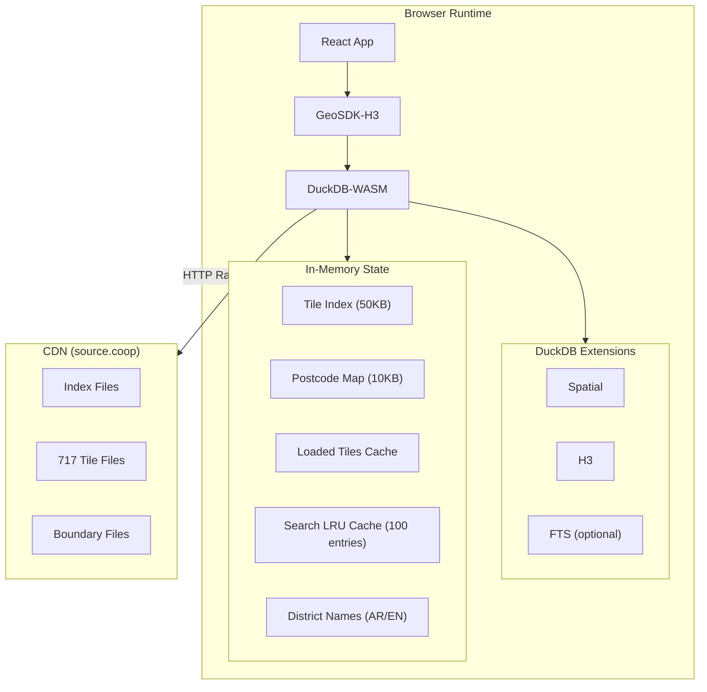
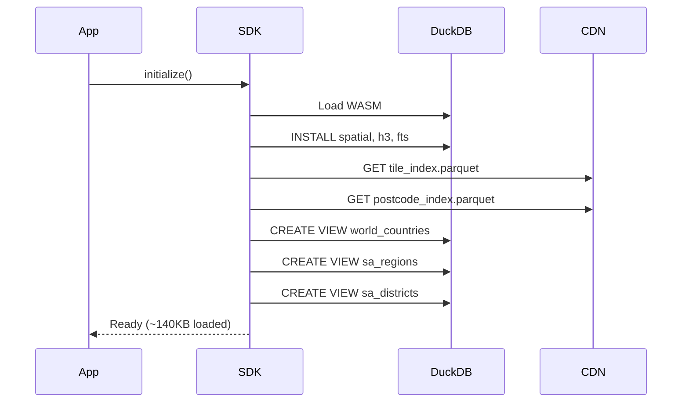
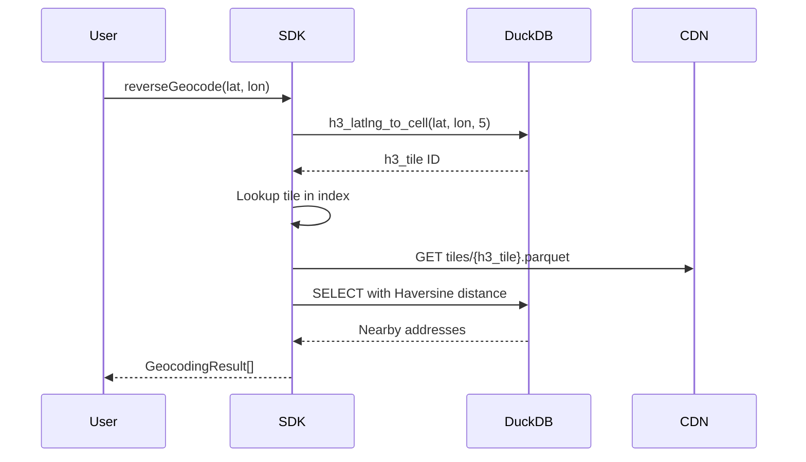
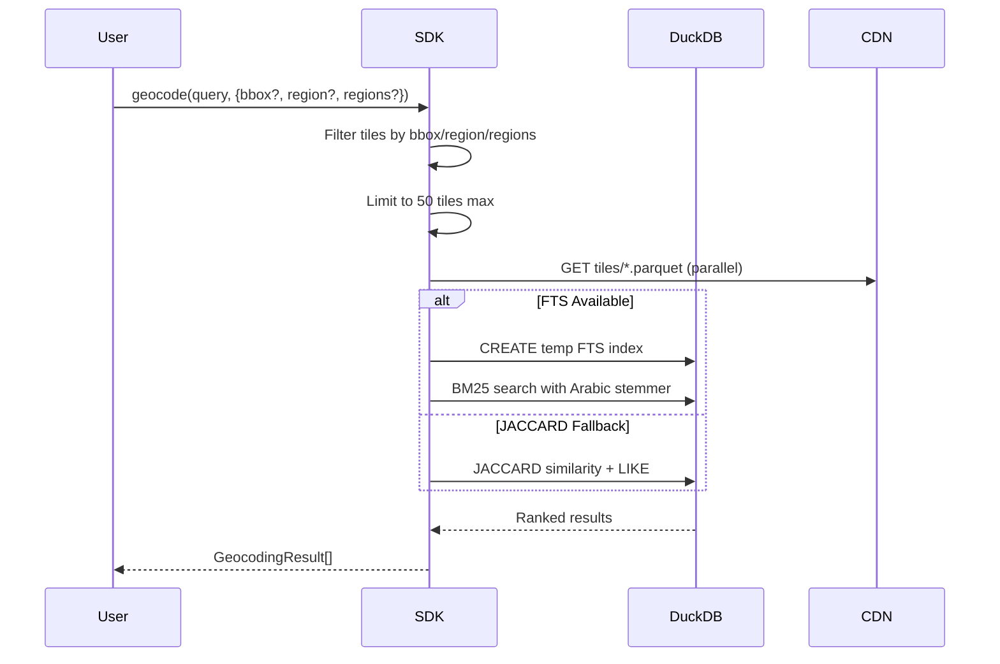
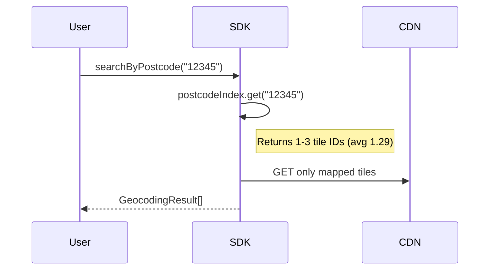
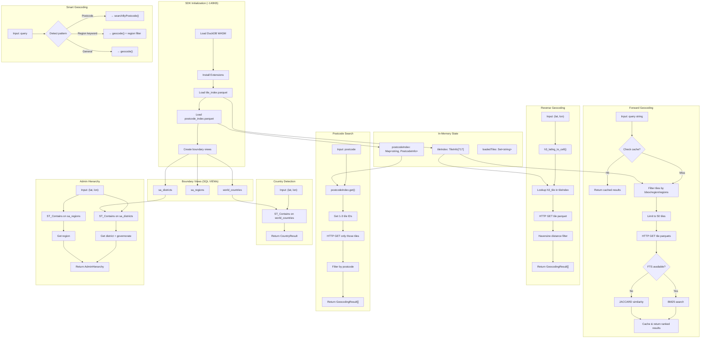
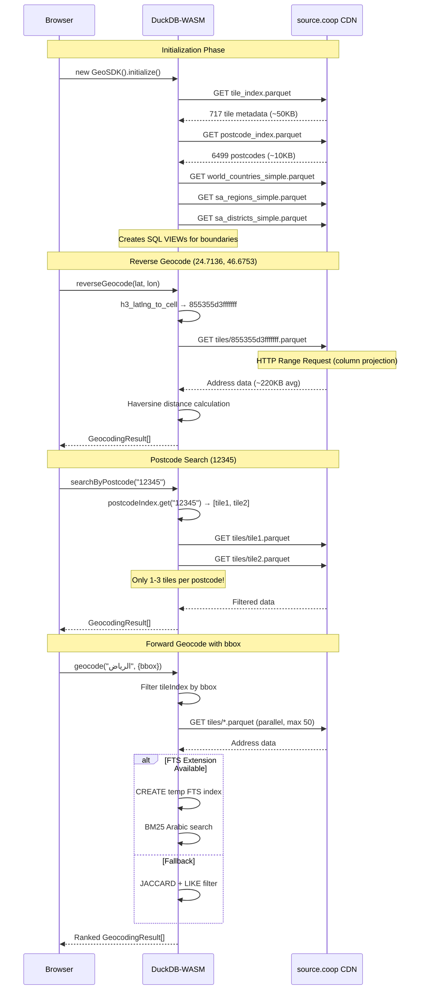

# Geocoding SDK Architecture

> Browser-based geocoding for Saudi Arabia using DuckDB-WASM + H3 spatial indexing

## Quick Stats

| Metric        | Value  |
| ------------- | ------ |
| Addresses     | 5.3M+  |
| Regions       | 13     |
| H3 Tiles      | 717    |
| Postcodes     | 6,499  |
| Districts     | 5,478  |
| Avg Tile Size | 220KB  |
| Max Tile Size | 6MB    |
| Total Data    | ~154MB |

---

## System Architecture



---

## Data Flow

### Initialization



### Reverse Geocoding



### Forward Geocoding



### Postcode Search



---

## Parquet Schema

### tile_index.parquet

```
h3_tile       VARCHAR   -- H3 cell ID (res 5)
addr_count    INTEGER   -- Addresses in tile
min_lon       DOUBLE    -- Bounding box
max_lon       DOUBLE
min_lat       DOUBLE
max_lat       DOUBLE
file_size_kb  INTEGER   -- Tile file size
region_ar     VARCHAR   -- Primary region (Arabic)
region_en     VARCHAR   -- Primary region (English)
```

### postcode_index.parquet

```
postcode      VARCHAR   -- 5-digit postcode
tiles         VARCHAR[] -- H3 tile IDs containing this postcode
addr_count    BIGINT    -- Total addresses
region_ar     VARCHAR
region_en     VARCHAR
```

### tiles/\*.parquet (Address Data)

```
addr_id         BIGINT   -- Unique address ID
longitude       DOUBLE
latitude        DOUBLE
number          VARCHAR  -- House/building number
street          VARCHAR  -- Street name (~96% coverage)
postcode        VARCHAR  -- Always present
district_ar     VARCHAR
district_en     VARCHAR
city            VARCHAR  -- City name (single field)
gov_ar          VARCHAR  -- Governorate Arabic
gov_en          VARCHAR  -- Governorate English
region_ar       VARCHAR
region_en       VARCHAR
full_address_ar VARCHAR  -- Concatenated full address
full_address_en VARCHAR
h3_index        VARCHAR  -- H3 cell (higher resolution)
```

### Boundary Files

```
-- world_countries_simple.parquet
iso_a3, iso_a2, name_en, name_ar, continent, geometry

-- sa_regions_simple.parquet
region_id, name_ar, name_en, centroid, geometry

-- sa_districts_simple.parquet
district_id, name_ar, name_en, city, region_ar, region_en, gov_ar, gov_en, centroid, geometry
```

---

## SDK API

### Configuration

```typescript
const sdk = new GeoSDK({
  dataUrl?: string,           // Custom CDN URL (default: source.coop)
  language?: 'ar' | 'en',     // Default language (default: 'ar')
  debug?: boolean,            // Enable debug logging (default: false)
  logLevel?: LogLevel         // 'debug' | 'info' | 'warn' | 'error' | 'none'
});

// Enable/disable debug at runtime
sdk.setDebug(true);
sdk.setDebug(true, 'debug');  // With log level
```

### Core Methods

```typescript
// Initialize (required first)
await sdk.initialize({ onProgress? })

// Reverse geocoding - coordinates to address
await sdk.reverseGeocode(lat, lon, {
  limit?: number,           // default: 10
  radiusMeters?: number,    // default: 1000
  detailLevel?: 'minimal' | 'postcode' | 'region' | 'full',
  includeNeighbors?: boolean
})

// Forward geocoding - address to coordinates
await sdk.geocode(query, {
  limit?: number,           // default: 10
  bbox?: [minLat, minLon, maxLat, maxLon],
  region?: string,          // single region name
  regions?: string[]        // multiple regions (NEW)
})

// Cached forward geocoding (LRU cache, 5min TTL)
await sdk.geocodeCached(query, options)

// Smart geocoding (auto-detects postcode/region in query)
await sdk.smartGeocode(query, options)

// Autocomplete suggestions
await sdk.getAutocompleteSuggestions(query, { limit?, bbox?, regions? })
// Returns: { suggestions: string[], type: 'district' | 'postcode' | 'general' }

// Postcode lookup (optimized - 1-3 tiles)
await sdk.searchByPostcode(postcode, {
  limit?: number,
  number?: string           // optional house number filter
})

// House number search
await sdk.searchByNumber(number, {
  limit?: number,
  region?: string,
  bbox?: [minLat, minLon, maxLat, maxLon]
})

// Country detection
await sdk.detectCountry(lat, lon)
// Returns: { iso_a3, iso_a2, name_en, name_ar, continent }

// Quick Saudi Arabia check
await sdk.isInSaudiArabia(lat, lon)
// Returns: boolean

// Admin hierarchy
await sdk.getAdminHierarchy(lat, lon)
// Returns: { district?, governorate?, region? } - each with {name_ar, name_en}

// Tile management
sdk.getTiles()                       // TileInfo[]
sdk.getLoadedTiles()                 // string[]
sdk.getTilesByRegion(region)         // TileInfo[]
await sdk.getTilesForBbox(bbox)      // string[]

// Utilities
sdk.getPostcodes(prefix?)            // PostcodeInfo[] for autocomplete
sdk.getSearchMode()                  // 'fts-bm25' | 'jaccard'
sdk.isFTSAvailable()                 // boolean
await sdk.getStats()                 // { totalTiles, totalAddresses, tilesLoaded, totalSizeKb }

// Cache management
sdk.clearCache()                     // Clear search result cache

// Cleanup
await sdk.close()
```

### Return Types

```typescript
interface GeocodingResult {
  addr_id: number;
  longitude: number;
  latitude: number;
  number?: string;
  street?: string;
  postcode?: string;
  district_ar?: string;
  district_en?: string;
  city?: string; // Note: single field, not city_ar/city_en
  gov_ar?: string;
  gov_en?: string;
  region_ar?: string;
  region_en?: string;
  full_address_ar?: string;
  full_address_en?: string;
  h3_index?: string; // H3 cell index (higher resolution)
  distance_m?: number; // reverse geocoding
  similarity?: number; // forward geocoding (0-1)
}

interface AdminHierarchy {
  district?: { name_ar: string; name_en: string };
  governorate?: { name_ar: string; name_en: string };
  region?: { name_ar: string; name_en: string };
}
```

---

## Frontend-SDK Alignment (FIXED)

### Changes Made

| Issue           | Before                       | After                                        |
| --------------- | ---------------------------- | -------------------------------------------- |
| Region filter   | `region: string` only        | `region?: string` + `regions?: string[]`     |
| Admin hierarchy | Missing governorate          | Includes `district`, `governorate`, `region` |
| Frontend types  | Mismatched with SDK          | Aligned with SDK return types                |
| City field      | Expected `city_ar/en`        | Uses `city` (single field)                   |
| h3_index        | Missing from GeocodingResult | Added `h3_index?: string`                    |
| Missing methods | 12 methods not exposed       | All SDK methods now in context               |
| Debug logging   | Not configurable             | `setDebug()` + log levels                    |
| Search cache    | Not available                | `geocodeCached()` + `clearCache()`           |

### SDK geocode() Options

```typescript
await sdk.geocode(query, {
  limit?: number,
  bbox?: [minLat, minLon, maxLat, maxLon],
  region?: string,        // Single region (backward compatible)
  regions?: string[]      // Multiple regions (NEW)
});
```

### AdminHierarchy Response

```typescript
// getAdminHierarchy() now returns:
{
  district?: { name_ar: string; name_en: string },
  governorate?: { name_ar: string; name_en: string },  // NEW
  region?: { name_ar: string; name_en: string }
}
```

### Playground Search Scope

The playground now includes toggles for:

- **Use visible map bounds** - limits search to current viewport bbox
- **Filter by region** - dropdown to select Saudi region

---

## Performance

| Operation                   | Cold   | Cached |
| --------------------------- | ------ | ------ |
| Reverse geocode             | <4s    | <100ms |
| Forward geocode (with bbox) | 2-5s   | <500ms |
| Postcode search             | <500ms | <100ms |
| Country detection           | <100ms | <50ms  |

### Column Projection (detailLevel)

| Level    | Columns | ~Transfer |
| -------- | ------- | --------- |
| minimal  | 3       | ~3MB      |
| postcode | 6       | ~4MB      |
| region   | 9       | ~6MB      |
| full     | 16      | ~47MB     |

---

## Caching & Search Optimization

### LRU Search Cache

The SDK maintains an in-memory LRU cache for forward geocoding results:

- **Cache size**: 100 entries max
- **TTL**: 5 minutes
- **Key**: Normalized query + options hash
- **Use**: `geocodeCached()` for repeated searches

```typescript
// Cached search - uses LRU cache
const results = await sdk.geocodeCached('الرياض', { limit: 10 });

// Clear cache manually
sdk.clearCache();
```

### Smart Geocoding

`smartGeocode()` auto-detects query patterns for optimized routing:

```typescript
// Detects postcode pattern → routes to searchByPostcode()
await sdk.smartGeocode('12345');

// Detects region in query → adds region filter
await sdk.smartGeocode('مكة الرياض'); // Filters to Riyadh region

// Regular query → uses standard geocode()
await sdk.smartGeocode('حي النخيل');
```

### Autocomplete

```typescript
// Get district/postcode suggestions
const { suggestions, type } = await sdk.getAutocompleteSuggestions('الر', {
  limit: 10,
  regions: ['منطقة الرياض'], // Optional region filter
});

// type: 'district' | 'postcode' | 'general'
// suggestions: ["الرياض", "الروضة", "الربوة", ...]
```

### Scope Filtering Best Practices

```typescript
// 1. Use bbox for map-based search (fastest)
await sdk.geocode(query, {
  bbox: [minLat, minLon, maxLat, maxLon], // Visible map bounds
});

// 2. Use regions for administrative filtering
await sdk.geocode(query, {
  regions: ['منطقة الرياض', 'المنطقة الشرقية'],
});

// 3. Combine for best results
await sdk.geocode(query, {
  bbox: mapBounds,
  regions: ['منطقة الرياض'], // Further narrows scope
});
```

---

## DuckDB SQL Patterns

```sql
-- H3 tile from coordinates
SELECT h3_h3_to_string(h3_latlng_to_cell(lat, lon, 5)) as h3_tile

-- Haversine distance
6371000 * 2 * ASIN(SQRT(
  POWER(SIN((RADIANS(latitude) - RADIANS(lat)) / 2), 2) +
  COS(RADIANS(lat)) * COS(RADIANS(latitude)) *
  POWER(SIN((RADIANS(longitude) - RADIANS(lon)) / 2), 2)
)) as distance_m

-- Spatial containment
SELECT * FROM sa_districts
WHERE ST_Contains(geometry, ST_Point(lon, lat))

-- FTS with Arabic stemmer
PRAGMA create_fts_index(table, id, field, stemmer='arabic')
SELECT fts_main_table.match_bm25(id, 'query') as score FROM table
```

---

## File Structure

```
geocoding-sdk/
├── src/
│   ├── index.ts          # Exports GeoSDK (alias for GeoSDKH3)
│   ├── types.ts          # Shared types, DEFAULT_DATA_URL
│   ├── geocoder-h3.ts    # Main SDK (~1440 lines) ← USE THIS
│   ├── logger.ts         # Debug logging system
│   ├── geocoder.ts       # Legacy region-based
│   └── geocoder-lazy.ts  # Legacy lazy-loading
├── examples/react/
│   └── app/
│       ├── context/geo-sdk-context.tsx  # SDK provider with all types
│       ├── routes/playground.tsx        # Interactive demo + search scope
│       └── routes/docs/*.tsx            # API documentation pages
├── docs/
│   └── ARCHITECTURE.md   # This file
└── dist/                 # Build output
```

---

## Source.coop Data URLs

### Base URL

```
https://data.source.coop/tabaqat/geocoding-cng/v0.1.0
```

### Index Files (Loaded at Init)

| File            | URL                                                                                    | Size   |
| --------------- | -------------------------------------------------------------------------------------- | ------ |
| Tile Index      | `https://data.source.coop/tabaqat/geocoding-cng/v0.1.0/tile_index.parquet`             | ~50KB  |
| Postcode Index  | `https://data.source.coop/tabaqat/geocoding-cng/v0.1.0/postcode_index.parquet`         | ~10KB  |
| World Countries | `https://data.source.coop/tabaqat/geocoding-cng/v0.1.0/world_countries_simple.parquet` | ~30KB  |
| SA Regions      | `https://data.source.coop/tabaqat/geocoding-cng/v0.1.0/sa_regions_simple.parquet`      | ~20KB  |
| SA Districts    | `https://data.source.coop/tabaqat/geocoding-cng/v0.1.0/sa_districts_simple.parquet`    | ~500KB |

### Top 20 Tile Files (by address count)

| H3 Tile           | Region  | Addresses | Size  | URL                                                                                   |
| ----------------- | ------- | --------- | ----- | ------------------------------------------------------------------------------------- |
| `855355d3fffffff` | Riyadh  | 177,152   | 6.0MB | `https://data.source.coop/tabaqat/geocoding-cng/v0.1.0/tiles/855355d3fffffff.parquet` |
| `8553736bfffffff` | Riyadh  | 142,125   | 4.6MB | `https://data.source.coop/tabaqat/geocoding-cng/v0.1.0/tiles/8553736bfffffff.parquet` |
| `8553a957fffffff` | Makkah  | 137,574   | 4.4MB | `https://data.source.coop/tabaqat/geocoding-cng/v0.1.0/tiles/8553a957fffffff.parquet` |
| `8553736ffffffff` | Riyadh  | 130,881   | 4.3MB | `https://data.source.coop/tabaqat/geocoding-cng/v0.1.0/tiles/8553736ffffffff.parquet` |
| `855355dbfffffff` | Riyadh  | 104,949   | 3.4MB | `https://data.source.coop/tabaqat/geocoding-cng/v0.1.0/tiles/855355dbfffffff.parquet` |
| `8553110ffffffff` | Madinah | 101,765   | 3.5MB | `https://data.source.coop/tabaqat/geocoding-cng/v0.1.0/tiles/8553110ffffffff.parquet` |
| `85534547fffffff` | Eastern | 94,802    | 2.6MB | `https://data.source.coop/tabaqat/geocoding-cng/v0.1.0/tiles/85534547fffffff.parquet` |
| `855355c3fffffff` | Riyadh  | 87,993    | 2.4MB | `https://data.source.coop/tabaqat/geocoding-cng/v0.1.0/tiles/855355c3fffffff.parquet` |
| `85536e53fffffff` | Eastern | 86,902    | 2.7MB | `https://data.source.coop/tabaqat/geocoding-cng/v0.1.0/tiles/85536e53fffffff.parquet` |
| `852c960ffffffff` | Eastern | 85,379    | 2.5MB | `https://data.source.coop/tabaqat/geocoding-cng/v0.1.0/tiles/852c960ffffffff.parquet` |
| `8553a92bfffffff` | Makkah  | 80,819    | 2.2MB | `https://data.source.coop/tabaqat/geocoding-cng/v0.1.0/tiles/8553a92bfffffff.parquet` |
| `8553a923fffffff` | Makkah  | 77,239    | 2.2MB | `https://data.source.coop/tabaqat/geocoding-cng/v0.1.0/tiles/8553a923fffffff.parquet` |
| `855354a7fffffff` | Riyadh  | 72,629    | 2.3MB | `https://data.source.coop/tabaqat/geocoding-cng/v0.1.0/tiles/855354a7fffffff.parquet` |
| `85530cb7fffffff` | Qassim  | 69,501    | 2.1MB | `https://data.source.coop/tabaqat/geocoding-cng/v0.1.0/tiles/85530cb7fffffff.parquet` |
| `85536327fffffff` | Eastern | 68,523    | 2.0MB | `https://data.source.coop/tabaqat/geocoding-cng/v0.1.0/tiles/85536327fffffff.parquet` |
| `8553113bfffffff` | Madinah | 66,853    | 2.3MB | `https://data.source.coop/tabaqat/geocoding-cng/v0.1.0/tiles/8553113bfffffff.parquet` |
| `8553a9cffffffff` | Makkah  | 65,643    | 1.9MB | `https://data.source.coop/tabaqat/geocoding-cng/v0.1.0/tiles/8553a9cffffffff.parquet` |
| `8552021bfffffff` | Asir    | 63,273    | 1.8MB | `https://data.source.coop/tabaqat/geocoding-cng/v0.1.0/tiles/8552021bfffffff.parquet` |
| `8553a93bfffffff` | Makkah  | 62,613    | 1.7MB | `https://data.source.coop/tabaqat/geocoding-cng/v0.1.0/tiles/8553a93bfffffff.parquet` |
| `85534573fffffff` | Eastern | 62,431    | 1.7MB | `https://data.source.coop/tabaqat/geocoding-cng/v0.1.0/tiles/85534573fffffff.parquet` |

### Tile URL Pattern

```
https://data.source.coop/tabaqat/geocoding-cng/v0.1.0/tiles/{h3_tile}.parquet
```

---

## Complete Data Sequence Flow



---

## HTTP Request Flow



---

## DuckDB Query Examples with URLs

```sql
-- Direct query to tile_index
SELECT * FROM read_parquet(
  'https://data.source.coop/tabaqat/geocoding-cng/v0.1.0/tile_index.parquet'
);

-- Query specific tile
SELECT * FROM read_parquet(
  'https://data.source.coop/tabaqat/geocoding-cng/v0.1.0/tiles/855355d3fffffff.parquet'
) LIMIT 10;

-- Query multiple tiles
SELECT * FROM read_parquet([
  'https://data.source.coop/tabaqat/geocoding-cng/v0.1.0/tiles/855355d3fffffff.parquet',
  'https://data.source.coop/tabaqat/geocoding-cng/v0.1.0/tiles/8553736bfffffff.parquet'
]);

-- Postcode lookup
SELECT * FROM read_parquet(
  'https://data.source.coop/tabaqat/geocoding-cng/v0.1.0/postcode_index.parquet'
) WHERE postcode = '12345';

-- Country detection
SELECT * FROM read_parquet(
  'https://data.source.coop/tabaqat/geocoding-cng/v0.1.0/world_countries_simple.parquet'
) WHERE ST_Contains(geometry, ST_Point(46.6753, 24.7136));
```
