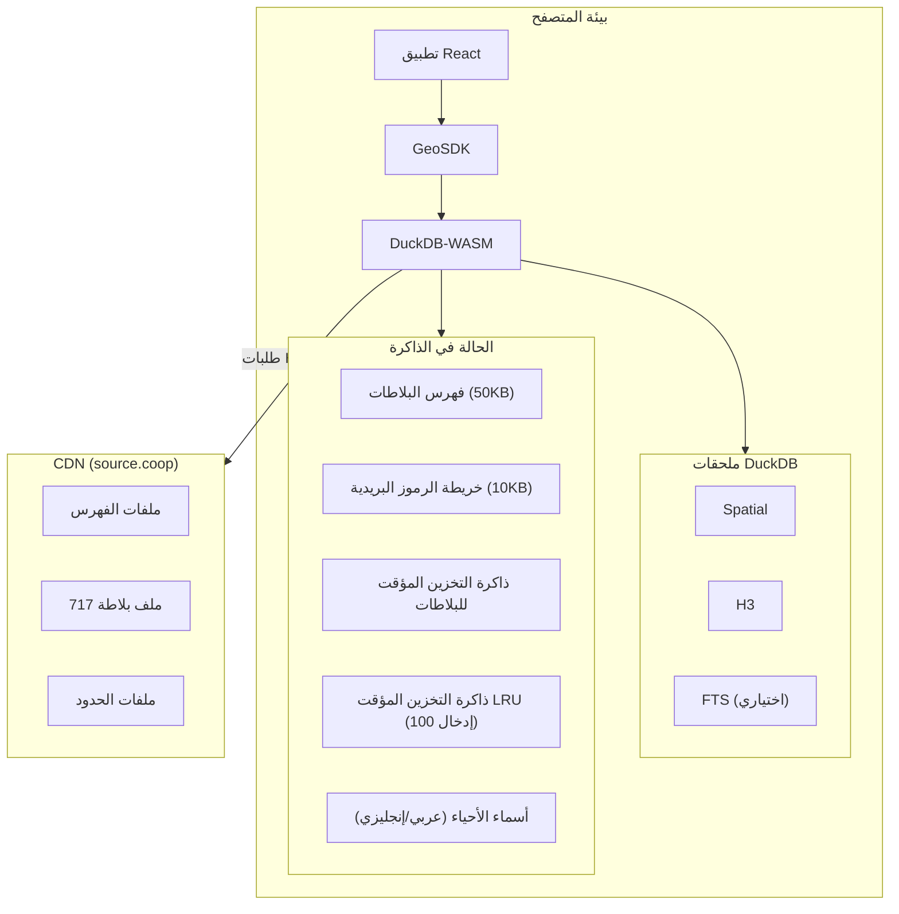
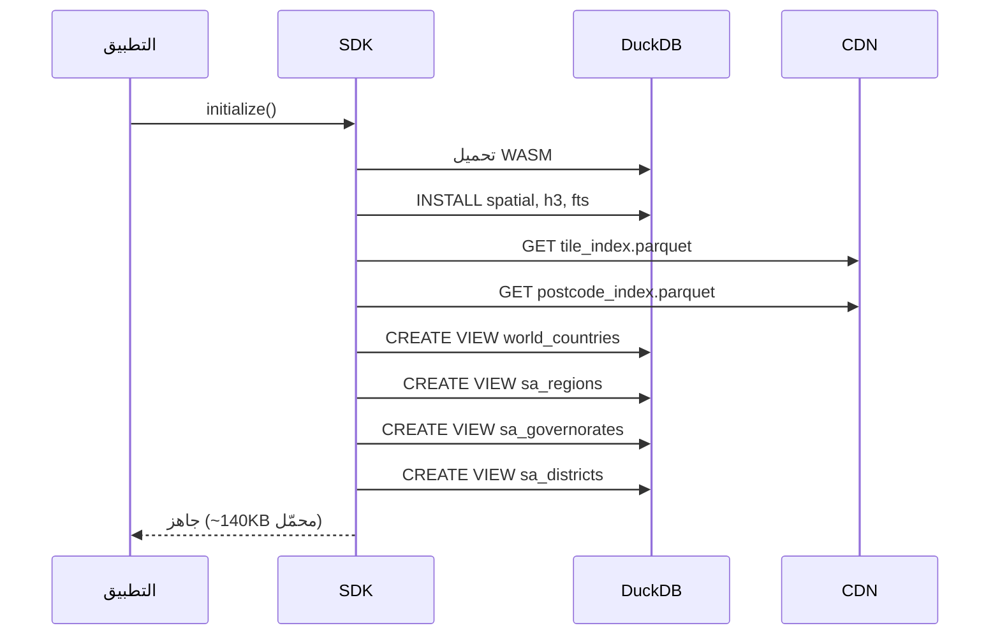
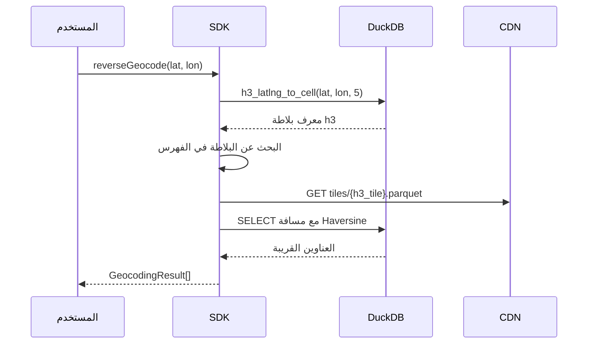
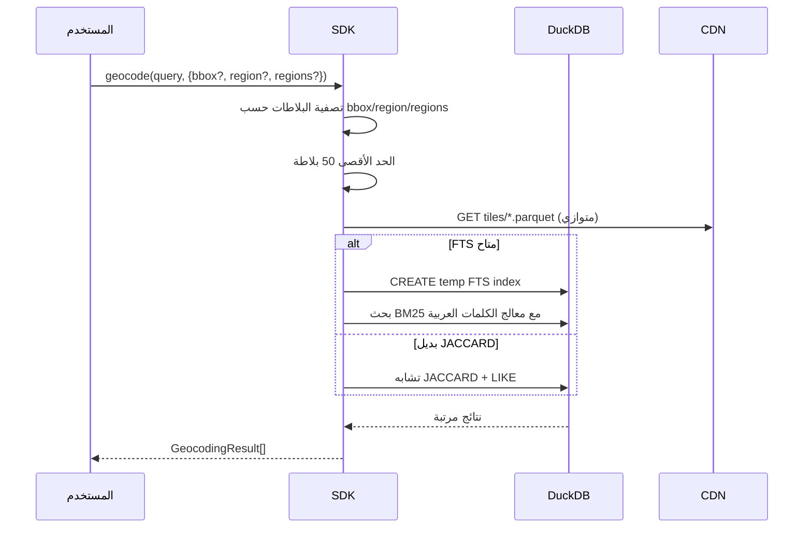
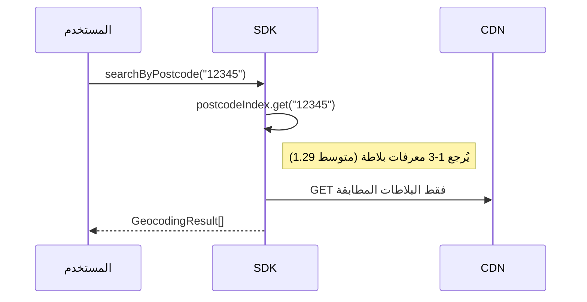

# هندسة SDK للترميز الجغرافي

> ترميز جغرافي يعتمد على المتصفح للمملكة العربية السعودية باستخدام DuckDB-WASM + فهرسة H3 المكانية

## إحصائيات سريعة

| المقياس              | القيمة   |
| -------------------- | -------- |
| العناوين             | 5.3M+    |
| المناطق              | 13       |
| بلاطات H3            | 717      |
| الرموز البريدية      | 6,499    |
| الأحياء              | 5,478    |
| متوسط حجم البلاطة    | 220KB    |
| أقصى حجم للبلاطة     | 6MB      |
| إجمالي البيانات      | ~154MB   |

---

## هندسة النظام



---

## التهيئة



## الترميز الجغرافي العكسي



## الترميز الجغرافي الأمامي



## البحث بالرمز البريدي



---

## الأداء

| العملية                              | بارد   | مخزن مؤقتاً |
| ------------------------------------ | ------ | ----------- |
| ترميز جغرافي عكسي                    | <4s    | <100ms      |
| ترميز جغرافي أمامي (مع bbox)         | 2-5s   | <500ms      |
| بحث بالرمز البريدي                   | <500ms | <100ms      |
| كشف الدولة                           | <100ms | <50ms       |

### إسقاط الأعمدة (detailLevel)

| المستوى  | الأعمدة | ~النقل   |
| -------- | ------- | -------- |
| minimal  | 3       | ~3MB     |
| postcode | 6       | ~4MB     |
| region   | 9       | ~6MB     |
| full     | 16      | ~47MB    |

---

## أمثلة استعلامات DuckDB

```sql
-- بلاطة H3 من الإحداثيات
SELECT h3_h3_to_string(h3_latlng_to_cell(lat, lon, 5)) as h3_tile

-- مسافة Haversine
6371000 * 2 * ASIN(SQRT(
  POWER(SIN((RADIANS(latitude) - RADIANS(lat)) / 2), 2) +
  COS(RADIANS(lat)) * COS(RADIANS(latitude)) *
  POWER(SIN((RADIANS(longitude) - RADIANS(lon)) / 2), 2)
)) as distance_m

-- الاحتواء المكاني
SELECT * FROM sa_districts
WHERE ST_Contains(geometry, ST_Point(lon, lat))

-- FTS مع معالج الكلمات العربية
PRAGMA create_fts_index(table, id, field, stemmer='arabic')
SELECT fts_main_table.match_bm25(id, 'query') as score FROM table
```

---

## عناوين بيانات Source.coop

### عنوان URL الأساسي

```
https://data.source.coop/tabaqat/geocoding-cng/v0.1.0
```

### ملفات الفهرس (محمّلة عند التهيئة)

| الملف                | عنوان URL                                                                              | الحجم  |
| -------------------- | -------------------------------------------------------------------------------------- | ------ |
| فهرس البلاطات        | `https://data.source.coop/tabaqat/geocoding-cng/v0.1.0/tile_index.parquet`             | ~50KB  |
| فهرس الرموز البريدية | `https://data.source.coop/tabaqat/geocoding-cng/v0.1.0/postcode_index.parquet`         | ~10KB  |
| دول العالم           | `https://data.source.coop/tabaqat/geocoding-cng/v0.1.0/world_countries_simple.parquet` | ~30KB  |
| مناطق السعودية       | `https://data.source.coop/tabaqat/geocoding-cng/v0.1.0/sa_regions_simple.parquet`      | ~20KB  |
| محافظات السعودية     | `https://data.source.coop/tabaqat/geocoding-cng/v0.1.0/sa_governorates_simple.parquet` | ~467KB |
| أحياء السعودية       | `https://data.source.coop/tabaqat/geocoding-cng/v0.1.0/sa_districts_simple.parquet`    | ~500KB |
