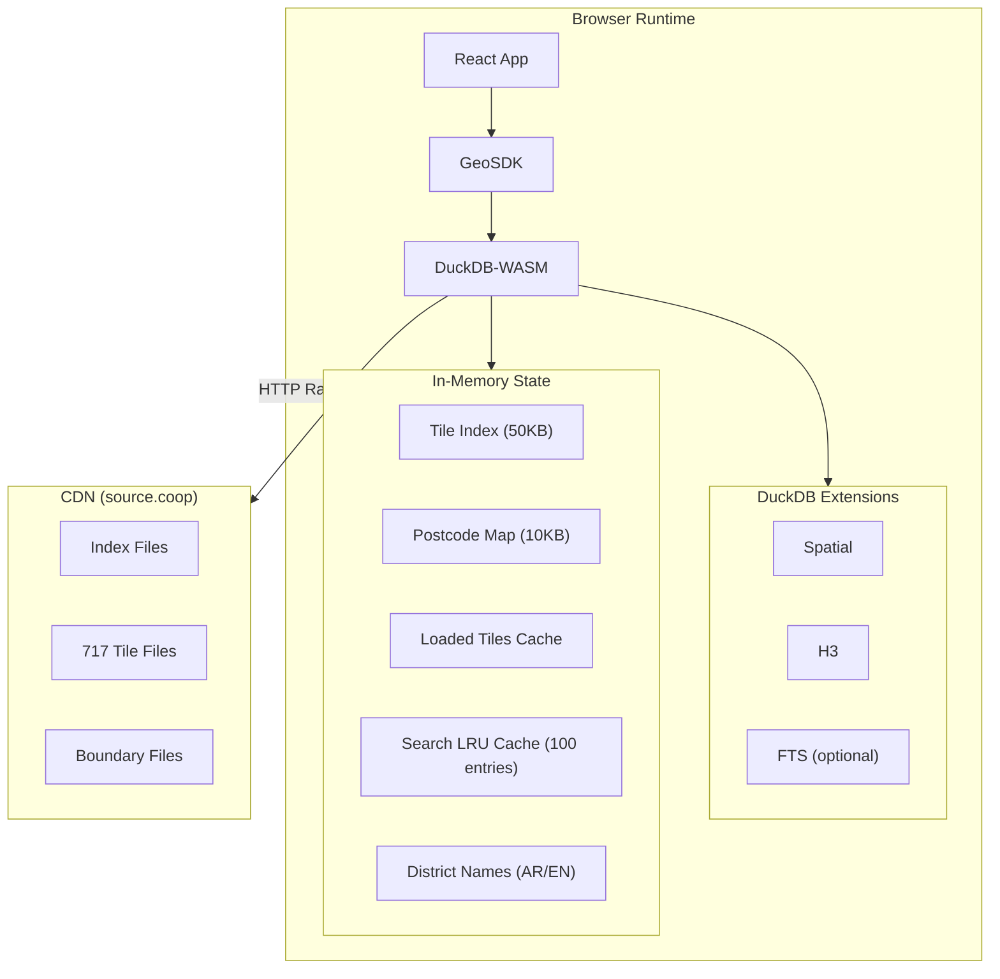
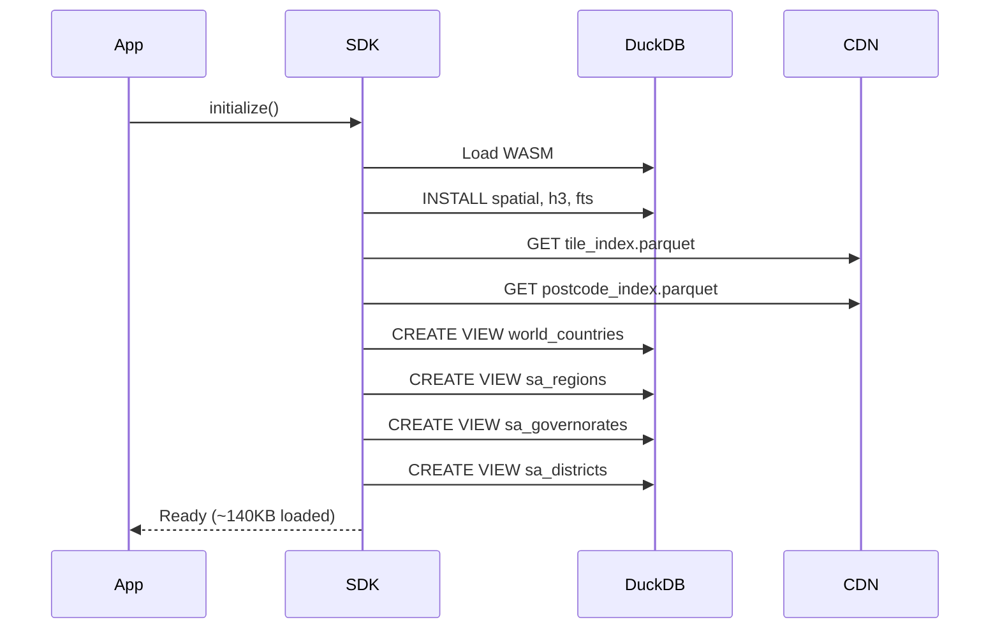
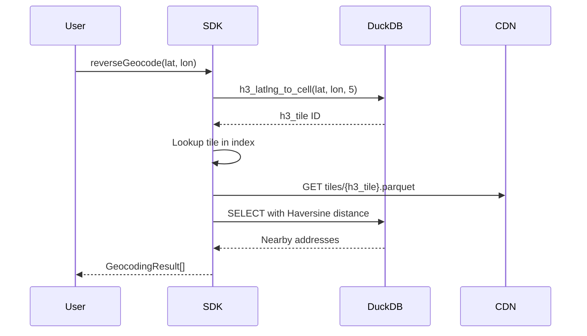
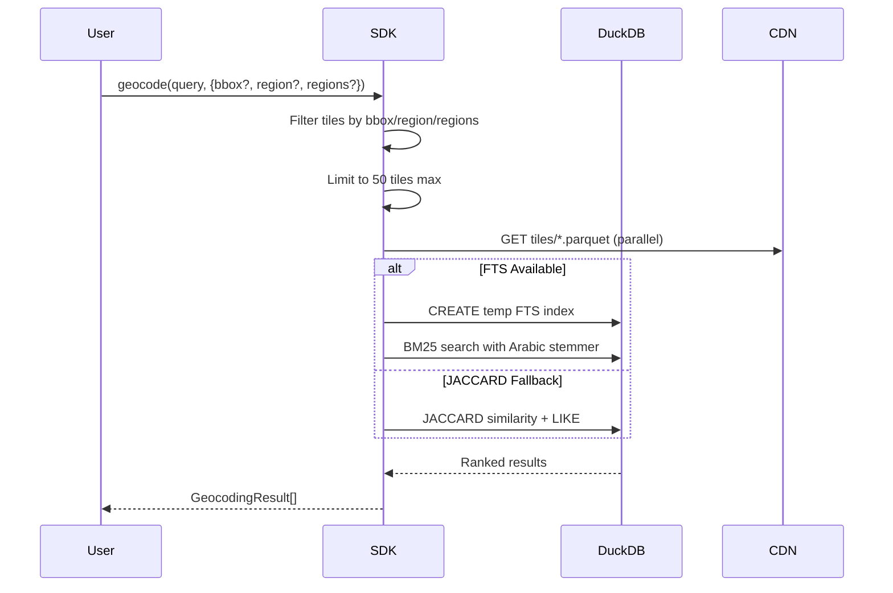
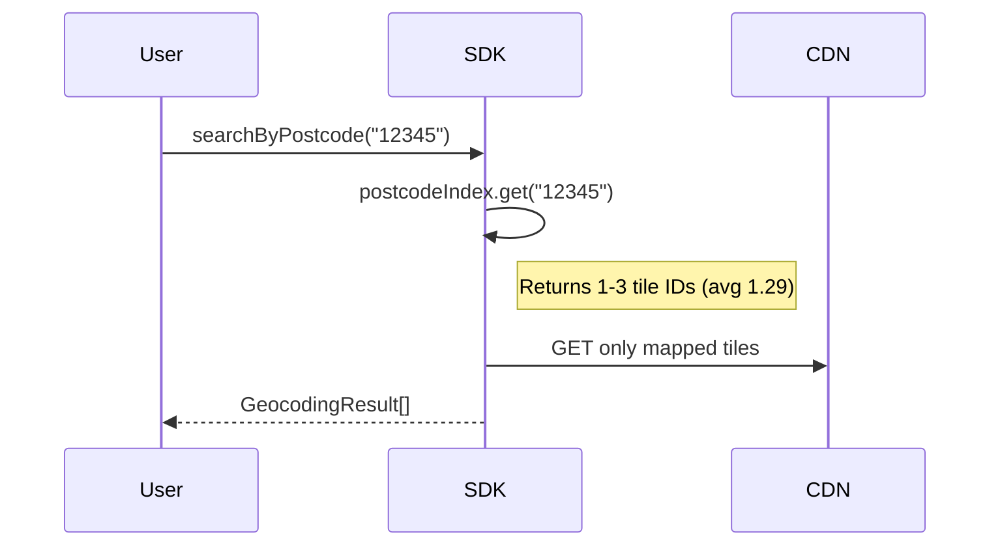

# Geocoding SDK Architecture

> Browser-based geocoding for Saudi Arabia using DuckDB-WASM + H3 spatial indexing

## Quick Stats

| Metric        | Value  |
| ------------- | ------ |
| Addresses     | 5.3M+  |
| Regions       | 13     |
| H3 Tiles      | 717    |
| Postcodes     | 6,499  |
| Districts     | 5,478  |
| Avg Tile Size | 220KB  |
| Max Tile Size | 6MB    |
| Total Data    | ~154MB |

---

## System Architecture



---

## Initialization



## Reverse Geocoding



## Forward Geocoding



## Postcode Search



---

## Performance

| Operation                   | Cold   | Cached |
| --------------------------- | ------ | ------ |
| Reverse geocode             | <4s    | <100ms |
| Forward geocode (with bbox) | 2-5s   | <500ms |
| Postcode search             | <500ms | <100ms |
| Country detection           | <100ms | <50ms  |

### Column Projection (detailLevel)

| Level    | Columns | ~Transfer |
| -------- | ------- | --------- |
| minimal  | 3       | ~3MB      |
| postcode | 6       | ~4MB      |
| region   | 9       | ~6MB      |
| full     | 16      | ~47MB     |

---

## DuckDB Query Examples

```sql
-- H3 tile from coordinates
SELECT h3_h3_to_string(h3_latlng_to_cell(lat, lon, 5)) as h3_tile

-- Haversine distance
6371000 * 2 * ASIN(SQRT(
  POWER(SIN((RADIANS(latitude) - RADIANS(lat)) / 2), 2) +
  COS(RADIANS(lat)) * COS(RADIANS(latitude)) *
  POWER(SIN((RADIANS(longitude) - RADIANS(lon)) / 2), 2)
)) as distance_m

-- Spatial containment
SELECT * FROM sa_districts
WHERE ST_Contains(geometry, ST_Point(lon, lat))

-- FTS with Arabic stemmer
PRAGMA create_fts_index(table, id, field, stemmer='arabic')
SELECT fts_main_table.match_bm25(id, 'query') as score FROM table
```

---

## Source.coop Data URLs

### Base URL

```
https://data.source.coop/tabaqat/geocoding-cng/v0.1.0
```

### Index Files (Loaded at Init)

| File            | URL                                                                                    | Size   |
| --------------- | -------------------------------------------------------------------------------------- | ------ |
| Tile Index      | `https://data.source.coop/tabaqat/geocoding-cng/v0.1.0/tile_index.parquet`             | ~50KB  |
| Postcode Index  | `https://data.source.coop/tabaqat/geocoding-cng/v0.1.0/postcode_index.parquet`         | ~10KB  |
| World Countries | `https://data.source.coop/tabaqat/geocoding-cng/v0.1.0/world_countries_simple.parquet` | ~30KB  |
| SA Regions      | `https://data.source.coop/tabaqat/geocoding-cng/v0.1.0/sa_regions_simple.parquet`      | ~20KB  |
| SA Governorates | `https://data.source.coop/tabaqat/geocoding-cng/v0.1.0/sa_governorates_simple.parquet` | ~467KB |
| SA Districts    | `https://data.source.coop/tabaqat/geocoding-cng/v0.1.0/sa_districts_simple.parquet`    | ~500KB |
